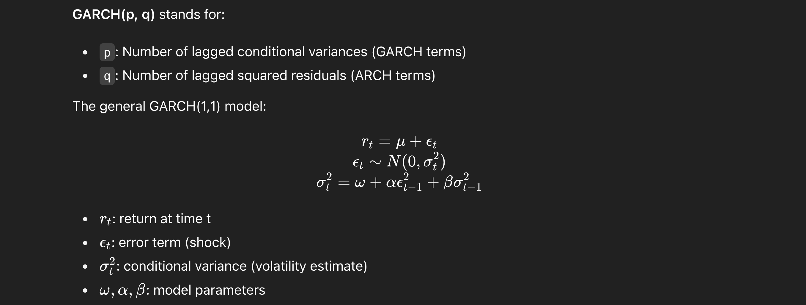

# Daily Signal Generation:

## What is GARCH model ? 

A rolling **GARCH model** (specifically Generalized Autoregressive Conditional Heteroskedasticity) is a dynamic statistical method used in trading and financial time series analysis to **model and forecast** volatility, which is key in understanding and managing risk in asset prices.

Applications of it include 
1. **Volatility Forecasting**: Used to estimate the next day’s volatility for options pricing or leverage decisions.

2. **Risk Management**: Compute dynamic Value-at-Risk (VaR) and Expected Shortfall.

3. **Portfolio Optimization**: Allocate capital depending on predicted risk.

4. **Trading Signals**: Sudden volatility surges could trigger entry or exit signals.

## What is GARCH, why is it used for daily signal generation ? 

**GARCH (p, q)** is a time series model used to estimate the **volatility** (variance) of returns. It captures the fact that financial markets tend to have volatility clustering – periods of high volatility followed by high volatility, and low followed by low.

## Advantages of using it: 
1. **Adapts to regime changes**: More responsive to shifts in market conditions (e.g., crisis periods).

2. **Improved forecast accuracy**: Helps avoid bias from outdated data.

3. **Better risk management**: Daily re-estimation provides time-varying Value-at-Risk (VaR), improving capital allocation.

## Comparision with other Time Series Model

1. Use SMA for trend **detection and entry/exit** signals.

2. Use GARCH for **risk forecasting, volatility modeling,** and **position sizing**.

# Intra-Day signal generation

An Intraday Signal based on **RSI and Bollinger Bands** is a short-term trading strategy that combines two technical indicators—**Relative Strength Index** (RSI) and Bollinger Bands—to identify high-probability entry or exit points within the same trading day.

## More about the technical-indicators:

1. **RSI (Relative Strength Index)**: 
Measures momentum of price movement.
Ranges from 0 to 100. Common interpretation

    RSI > 70 → Overbought (potential sell)

    RSI < 30 → Oversold (potential buy)

2. **Bollinger Bands**: Consist of:

    Middle Band: 20-period Simple Moving Average (SMA)
    
    Upper Band: SMA + 2 standard deviations
    
    Lower Band: SMA − 2 standard deviations
    
    Measures volatility.
    
    When price touches upper/lower band, it may signal reversal or breakout